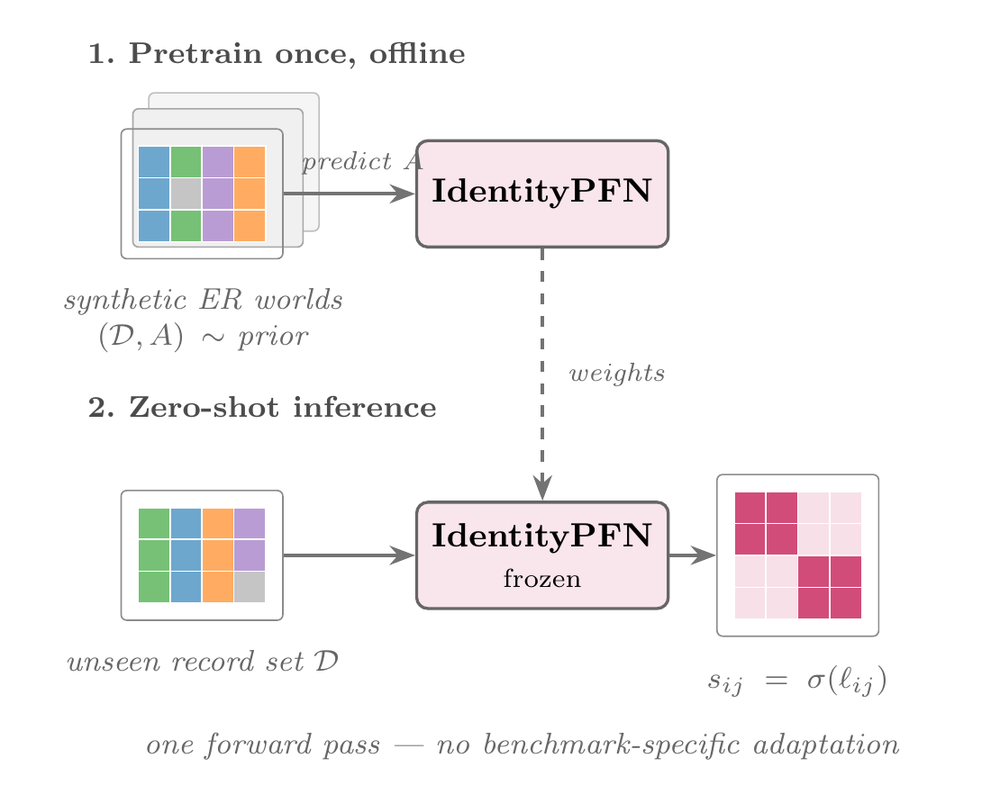
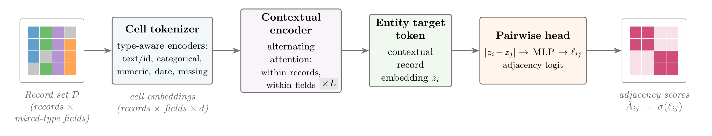
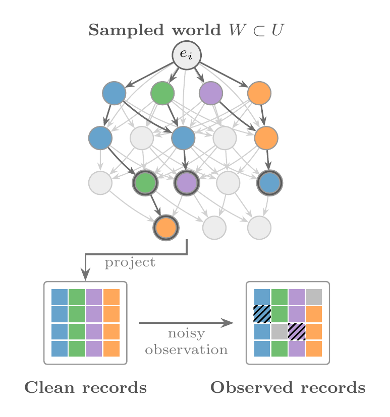

# IdentityPFN

<p align="center">
  
</p>

IdentityPFN is an open-source toolkit for zero-shot entity resolution: load a
frozen checkpoint, score duplicate likelihoods across records, and inspect the
highest-confidence links without target-domain labels or benchmark-specific
training.

This repository is the anonymous artifact for **“IdentityPFN: Learning
Identity Priors for Zero-Shot Entity Resolution.”** It contains the model and
synthetic data generator, paper checkpoints, evaluation scripts, compact
result tables, and configuration metadata. Benchmark records that cannot be
safely redistributed are intentionally excluded.

## Quick start

The fastest way to see the intended user workflow is the demo notebook:

[`notebooks/demo_zero_shot_linking.ipynb`](notebooks/demo_zero_shot_linking.ipynb)

It loads a released checkpoint, scores a small record table, plots an adjacency
heatmap, retrieves nearest neighbors, and builds a side-by-side review table.
The core API is intentionally small:

```python
import identitypfn as idpfn

model = idpfn.load_model("results/model_checkpoints/20260715_195803_seed1337_20005214_best_step1500.pt")
scores = model.predict_proba(records, field_types="infer")

idpfn.top_pairs(scores, k=10)
idpfn.nearest_neighbors(scores, k=3)
idpfn.pair_review_table(scores, records, k=10)
```

## How it works

<p align="center">
  
</p>

At a high level:

- Synthetic identity worlds teach the model reusable priors over names,
  identifiers, contact fields, missingness, corruption, and cross-field
  evidence.
- The tokenizer embeds heterogeneous table values with field-type hints.
- The PFN scores the full record-by-record adjacency matrix in one forward
  pass.
- Helper functions turn the score matrix into top-pair, nearest-neighbor, and
  review-table views for inspection.

## Repository contents

- Core model and inference code: `identitypfn/model.py`,
  `identitypfn/tokenizer.py`, `identitypfn/inference.py`, and
  `identitypfn/train.py`
- Synthetic identity priors: `identitypfn/dgp/people/wag.py`,
  `identitypfn/dgp/people/simple.py`, `identitypfn/dgp/people/wag_rules/`, and
  `dgp_data/` 
- Experiment entry points: `run_benchmark_experiment.py`, `run_dgp_smoke.py`,
  and related `run_*.py` diagnostics
- Paper checkpoints: `results/model_checkpoints/`
- Paper result inputs and summaries: `results/`
- Classical and LLM-selector comparison runners: `baselines/`
- Dataset manifest and preparation tooling: `benchmark_data/`
- Retained analysis workflows: `notebooks/`

The Python modules retain a few historical `NanoERPFN` class names so the
released checkpoints and experiment scripts remain directly compatible.

## Environment

The recorded project environment uses Python 3.13 and is locked with
[`uv`](https://docs.astral.sh/uv/):

```bash
uv sync --no-dev
```

Use `--no-dev` on `uv run` commands when you want to keep this minimal
environment unchanged; otherwise `uv run` may sync default dependency groups
before executing the command.

Ollama, fastText, and competitor baselines are optional:

```bash
uv sync --extra ollama
uv sync --extra fasttext
uv sync --extra baselines
```

For the retained notebooks and plotting script, include the development group:

```bash
uv sync --group dev
```

The paper checkpoints use
`sentence-transformers/all-MiniLM-L6-v2`. The encoder is downloaded by
Sentence Transformers on first use and is not duplicated in this repository.

## Quick verification

Run a small synthetic-prior diagnostic without Ollama or external benchmark
data:

```bash
uv run --no-dev python run_dgp_batch_diagnostics.py \
  --generator wag \
  --num-batches 2 \
  --batch-size 2 \
  --no-ollama
```

Run the repository checks:

```bash
uv run --no-dev python -m unittest discover -s tests
```

The larger `run_dgp_smoke.py` path trains a small model and currently uses the
optional fastText backend. Download `cc.en.300.bin` separately and provide it
at the repository root before using that script.

## Released checkpoints

The main paper checkpoint is:

```text
results/model_checkpoints/
  20260715_195803_seed1337_20005214_best_step1500.pt
```

The hard-negative diagnostic checkpoint is:

```text
results/model_checkpoints/
  20260721_200947_seed1337_bda60282_best_step1500.pt
```

Additional checkpoints are retained to support the reported training and
ablation history. Each checkpoint stores its run configuration alongside the
model state dictionary.

## Benchmark data

`benchmark_data/manifest.json` records the exact schemas, field types, sampling
rules, and expected converted paths used by the evaluation scripts. Only the
two synthetic smoke datasets are included. See
[`benchmark_data/README.md`](benchmark_data/README.md) for the data boundary
and preparation workflow.

The CSV files under `results/` are derived metrics and compact paper artifacts;
they do not contain the excluded benchmark record tables.

## Reproducing evaluations

The main experiment runner is:

```bash
uv run python run_benchmark_experiment.py --help
```

Diagnostic and comparison entry points include:

- `run_field_evidence_diagnostics.py`
- `run_field_type_sweep.py`
- `baselines/run_splink_baseline.py`
- `baselines/run_pyjedai_baseline.py`
- `baselines/run_comem_candidate_selector.py`
- `baselines/run_comem_bpid_selector.py`

Splink and pyJedAI require the `baselines` optional dependency group. The
ComEM-style scripts require an `OPENAI_API_KEY` and make paid API calls; no key
or raw API response is included.

## License and attribution

IdentityPFN is distributed under the Apache License 2.0. The implementation
adapts nanoTabPFN and includes a modified PyTorch transformer layer. Synthetic
generation resources have their own attribution requirements. See
[`THIRD_PARTY_NOTICES.md`](THIRD_PARTY_NOTICES.md) and the resource-local
license files for details.
